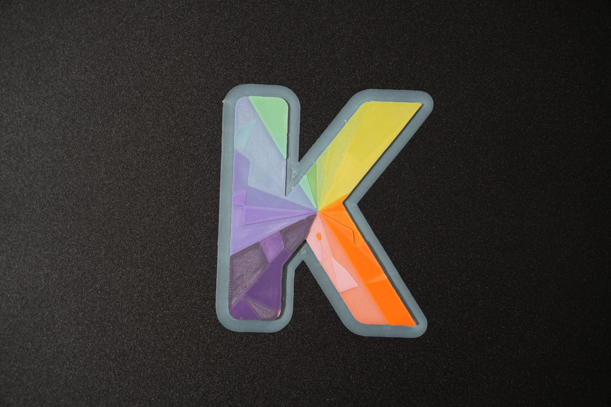

# Print findings — Kromacut logo test (2026-07-02)

First real auto-paint print with the measured frontlit calibration
(`tests/assets/filament-profiles/8_Colors_Calibrated_New.kfil`, 8 filaments,
accurate-mode 2-base reads, JND 2.0 default).

Images: `image.png` — the app's 3D preview projection; `print-photo.jpg` — photo
of the physical print on a dark mat (downscaled from the 22 MB camera original,
which stays untracked next to it).

Print setup: normal mode (NOT flat paint — no transparent carrier; the grey rim
in the photo is a border/brim, not a carrier). Transition opacity: default
(0.8 unless changed). Layer height 0.08 mm.

## Overall verdict

- **Hue placement is accurate across the whole wheel** — green→yellow→orange→red
  transitions and the purple family land where the preview says. The calibrated
  endpoints are doing their job.
- **Systematic desaturation/wash:** the print is uniformly lighter and less
  saturated than the preview, worst in dark saturated colors (cyan → pale blue,
  violet → lavender, red → orange-ish).

## Specific failures (user-observed)

1. **Orange over pink did not shift toward red** as the preview predicted — it
   stayed orange.
2. **First layer of cyan over purple is not the predicted darker blue** — it
   reads as light, washed purplish.

## Analysis

### Weak-channel TDs are heuristic floors, not measurements (primary suspect)

Both failures are thin layers over a saturated, differently-hued base, failing
the same way: the model predicts the top filament's complementary channel kills
the base almost instantly; physically it does not.

- Cyan `#00b8c4` fitted `td = [0.068, 0.354, 0.373]`. `td_R = 0.068 mm` ⇒ one
  0.08 mm layer transmits only ~7% red ⇒ purple's red should die ⇒ dark blue.
  Reality: red survives ⇒ true `td_R` is substantially larger.
- That 0.068 was never measured: cyan's swatch R = 0, so the `1 + c×5.8`
  heuristic pins the channel at its floor, and the black + white base reads
  constrain it weakly — the fit's regularization left it at the prior. Same for
  orange `#d83400`'s G/B channels (0.137 / 0.103) interacting with pink.
- **Actionable:** recalibrate with complementary-hue bases that stress the weak
  channel directly — cyan over a red/orange base (pins `td_R`), orange over a
  cyan/blue base (pins `td_G`/`td_B`). Accurate mode's manual base override
  supports this today. More generally: the auto base picker prefers channel
  diversity but chose black+white here; consider whether it should specifically
  seek a base that is bright in the filament's darkest channel.

### Partial-opacity stacks (contributing, magnitude unknown)

Auto-paint stops stacks at the transition-opacity target (default 0.8), so
regions show ~20% of the underlying stack. The calibration pins the opacity
*endpoint*; the *interior* of the curve is assumed exponential per channel. If
real filaments scatter, partial stacks pick up unmodeled white backscatter →
wash. Cheap probe: reprint a section at transition opacity 0.95 and compare
saturation gain against the preview's own change.

### Emissive display vs reflective print (irreducible)

The preview on a dark background on a monitor emits saturated light a reflective
object cannot return; deep blues/cyans suffer most. Even a perfect model looks
more vivid on screen. Sets a ceiling on "matching the preview".

## Phase-3 gate ledger (scattering evidence)

Signal 3 (stack prediction failures): **one entry, partially implicating.** The
wash direction (extra lightness, weak complementary-channel kill in thin layers)
is consistent with scattering, but confounded with the heuristic-floor channel
TDs, which absorption-model recalibration with better bases may fix. Signals 1
(fit residuals) and 2 (merge reads) from the calibration session remain
negative. **Gate still not triggered** — retest after complementary-base
recalibration.

## Follow-ups (in order)

1. Recalibrate cyan (red base) and orange (cyan/blue base); reprint the affected
   regions or small stack patches; recheck failures 1 and 2.
2. Transition-opacity 0.95 comparison print for the wash magnitude question.
3. Build the metamer-pair validation strip (still-open Phase 2 item) — it tests
   exactly these cross-color stack predictions in a controlled way.
4. If failures persist with well-pinned channels → real Phase-3 (scattering)
   evidence; revisit the gate.
