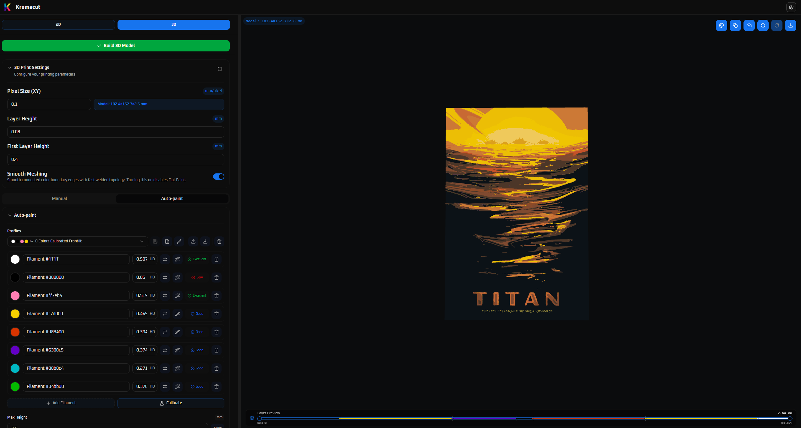
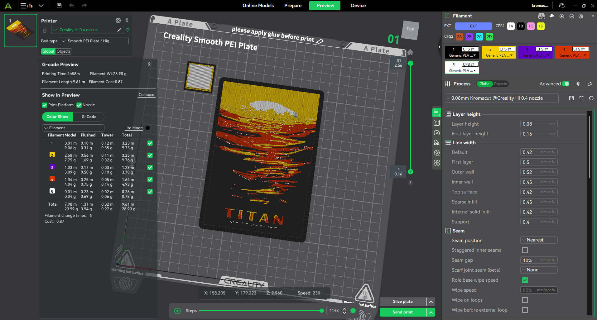

# Kromacut

Turn a 2D image into a stacked, color-layered 3D print. Kromacut is a free, open-source HueForge-style tool that runs in your browser or as a desktop app for Windows, macOS, and Linux.

[](https://github.com/vycdev/Kromacut/releases/latest) [](https://github.com/vycdev/Kromacut/releases) [](https://github.com/vycdev/Kromacut/releases/latest) [](https://github.com/vycdev/Kromacut)

**[Open the app](https://kromacut.com/app)** · [Website](https://kromacut.com/) · [User documentation](https://kromacut.com/docs/overview) · [Desktop downloads](https://github.com/vycdev/Kromacut/releases)

[Video guides](#video-guides) · [Examples](#examples) · [Features](#features) · [How to use](#how-to-use) · [Printing and export](#printing-and-export) · [Documentation](#documentation) · [Desktop app](#native-desktop-app-tauri) · [Development](#development) · [Contributing](#contributing)

## Video guides

Click a thumbnail to watch on YouTube.

### Tutorial

[Turn Any Image into a Multicolor 3D Print | Kromacut Tutorial](https://youtu.be/NnaTVuJ2Sps) — Follow the image-to-print workflow.

[](https://youtu.be/NnaTVuJ2Sps)

### Original introduction

[I Recreated the Industry’s Most Advanced 3D Printing App… For Free](https://youtu.be/nTcZJ2gG7zo) — Meet the project and the idea behind Kromacut.

[](https://youtu.be/nTcZJ2gG7zo)

For current controls and settings, use the [written quick start](https://kromacut.com/docs/quick-start) alongside the videos.

## Examples

Projects from the [landing-page community showcase](https://kromacut.com/). Click an image to open the full-size view.

### Titan: from preview to finished print

| Kromacut prediction | Slicer preview | Finished print |
| --- | --- | --- |
| [](content/community/titan-kromacut-preview.png) | [](content/community/titan-slicer-preview.png) | [](content/community/titan-finished.jpg) |

Print and previews by **vycdev**. Original artwork: [NASA/JPL - Titan, Visions of the Future](https://www.jpl.nasa.gov/images/titan-jpl-travel-poster/).

Preview colors are predictions; filament, calibration, lighting, and camera processing affect the finished result.

### More finished prints

| Hobbits and Dragons | King of Hearts | Hope poster |
| --- | --- | --- |
| [](content/community/hobbits-and-dragons-1.jpg) | [](content/community/king-of-hearts.jpg) | [](content/community/hope-finished.jpg) |
| By [u/ominaex25](https://www.reddit.com/r/kromacut/comments/1vum7om/hobbits_and_dragons/) | By **vycdev** | By **vycdev** |

| Batman: The Jiro Kuwata Batmanga | Naruto |
| --- | --- |
| [](content/community/batmanga-finished.jpg) | [](content/community/naruto-finished.jpg) |
| By **vycdev**. Artwork: [Jiro Kuwata / DC - Batmanga, Book 1](https://m.media-amazon.com/images/I/81rOZq5ZgqL._AC_UF1000,1000_QL80_.jpg). | By **vycdev**. Artwork: [Naruto](https://in.pinterest.com/pin/169870217190172931/). |

## Features

- **Image preparation:** Drag-and-drop upload, non-destructive adjustments, resizing, color reduction, dedithering, and pixel touch-up tools.
- **Manual layer control:** Edit palette colors, reorder them, and set per-color heights.
- **Auto-paint:** Plan physical filament stacks from your real filament colors and hiding distances, with five deterministic optimizer effort tiers and region weighting.
- **Filament calibration and profiles:** Measure hiding distance with printed wedges, compare Palette Proofs, photograph Stack Matrices, and save or share filament profiles.
- **2D and 3D previews:** Inspect the stack layer by layer and compare simulated blends with physical filament colors.
- **Printable exports:** Download STL or color-aware 3MF files and copy a print plan with filament swap layers.
- **Flat Paint (experimental):** Make a flat face-up or face-down slab for multi-material printing via 3MF.

## How to use

1. **Load an image** with the upload button or drag it into the 2D preview.
2. **Prepare it in 2D.** Apply any image adjustments, resize if needed, and reduce colors in Quantization Settings. Start with K-means and an Auto palette; use Dedither if isolated speckles remain.
3. **Switch to 3D.** Set Pixel Size (XY), Layer Height, and First Layer Height to match your intended print and slicer settings.
4. **Choose Auto-paint or Manual** using the workflows below.
5. **Click Build 3D Model** and inspect the result with the Layer Preview slider.
6. **Export** from the download menu, copy the Print Instructions, and check the sliced model before printing.

After changing the image or 3D settings, click **Build 3D Model** again before exporting. Auto-paint recalculates its stack automatically, but the displayed geometry and export stay tied to the last build.

### Auto-paint

Use Auto-paint when you want Kromacut to plan the filament stack:

1. Add the filaments you actually own, or load a saved profile.
2. Set each filament's color and **Hiding Distance (HD)**. Open **Calibrate → Hiding Distance** to measure HD with a printed wedge, or start with an estimate. **Convert from TD** accepts conventional backlit TD values.
3. Leave **Max Height** on **Auto** initially. Enable **Enhanced color matching** to search for a better filament order; **Balanced** is a practical starting tier.
4. Wait for calculation, inspect the transition zones and confidence details, then build the model.

Profiles are saved locally and can be exported as `.kfil` files. Imports also accept legacy `.kapp`, `.json`, and HueForge spool `.csv`/`.tsv` files. Save changes to your named profile before exporting a backup so its Palette Proof and Stack Matrix evidence is included.

See the [Auto-paint guide](https://kromacut.com/docs/auto-paint) for optimizer tiers, repeated swaps, color separation, height dithering, region weighting, and filament suggestions. The [calibration workflows guide](https://kromacut.com/docs/calibration-workflows) covers wedges, Palette Proofs, and Stack Matrices.

### Manual mode

Use Manual when you want direct control over the image colors:

1. Reduce the image to the palette you want to work with.
2. Edit swatches in **Image colors** as needed.
3. In **3D → Manual**, drag colors into print order and adjust each color's slice height.
4. Build the model, inspect the layers, and export with the copied swap plan.

See the [3D mode guide](https://kromacut.com/docs/3d-mode) for dimensions, layer snapping, manual heights, and preview controls.

## Printing and export

- Default regular layer height: **0.12 mm**. Default first-layer height: **0.20 mm**.
- Match both layer heights in Kromacut and your slicer so the color-swap layer numbers agree.
- Set the intended physical size with **Pixel Size (XY)** before building.
- Use the **Layer Preview** slider to inspect transitions. Trimming the preview does not trim the exported model.
- Keep the export at **100% Z scale** with constant layer height. To change layer height, update it in Kromacut and rebuild.
- Preview colors are predictions; filament, calibration, printing conditions, and lighting affect the finished result.

| Format | Use it for |
| --- | --- |
| **STL** | A widely supported geometry file. Add filament swaps in your slicer using the Print Instructions. |
| **3MF** | Color-aware output with physical filament assignments for compatible slicers. Review those assignments and your printer settings. |

Flat Paint exports use **3MF only**. See the [Flat Paint guide](https://kromacut.com/docs/flat-paint) for face-up and face-down layouts.

### 3MF export (preview)

3MF preserves physical filament colors rather than assigning a new material to every simulated blend. It is a model file, not ready-to-run G-code: choose your printer and filament profiles, review the slicer settings, and slice it before printing.


Read [Generating and exporting output](https://kromacut.com/docs/generating-exporting-output) for build behavior, swap-layer interpretation, slicer setup, and saving files. Report export problems in [GitHub Issues](https://github.com/vycdev/Kromacut/issues).

## Hiding Distance (HD) and Transmission Distance (TD)

Thin filament layers can blend into intermediate shades, as popularized by [HueForge](https://shop.thehueforge.com/blogs/news/what-is-hueforge). Auto-paint estimates these blends from your filament colors and **Hiding Distance (HD)**: the depth at which a filament hides the material beneath it under front lighting.

Conventional backlit/lithophane **Transmission Distance (TD)** is a different input, roughly **10× HD**. Use **Convert from TD** on the filament row to convert it; do not convert an existing HD value again.

Printed wedge calibration measures frontlit HD. Palette Proofs and Stack Matrices provide additional evidence about actual printed stacks. See [Calibration theory](https://kromacut.com/docs/calibration-theory) for the optical model and [Calibration workflows](https://kromacut.com/docs/calibration-workflows) for practical steps.

## Documentation

The [user documentation](https://kromacut.com/docs/overview) is also available inside the app. Start with the guide for your task:

| Task | Guide |
| --- | --- |
| Make your first print | [Quick start](https://kromacut.com/docs/quick-start) |
| Prepare and clean up artwork | [Loading images](https://kromacut.com/docs/loading-images), [Image adjustments](https://kromacut.com/docs/image-adjustments), [Reducing colors](https://kromacut.com/docs/reducing-colors), [Dedithering](https://kromacut.com/docs/dedithering-cleanup) |
| Set dimensions and plan layers | [3D mode](https://kromacut.com/docs/3d-mode), [Auto-paint](https://kromacut.com/docs/auto-paint), [Flat Paint](https://kromacut.com/docs/flat-paint) |
| Calibrate filaments and check blends | [Calibration workflows](https://kromacut.com/docs/calibration-workflows), [Calibration theory](https://kromacut.com/docs/calibration-theory) |
| Export and set up the slicer | [Generating and exporting output](https://kromacut.com/docs/generating-exporting-output) |
| Find settings or solve a problem | [Settings and controls](https://kromacut.com/docs/settings-and-controls), [Troubleshooting](https://kromacut.com/docs/troubleshooting), [FAQ](https://kromacut.com/docs/faq) |

For project changes, see the [Changelog](CHANGELOG.md).

## Native desktop app (Tauri)

Download a pre-built app from [GitHub Releases](https://github.com/vycdev/Kromacut/releases):

| Platform | Download |
| --- | --- |
| macOS Apple Silicon | `*_aarch64.dmg` |
| macOS Intel | `*_x86_64.dmg` |
| Windows | `*-setup.exe` |
| Windows without internet access | `*_offline-setup.exe` (includes the WebView2 offline installer) |
| Linux | `*.AppImage` or `*.deb` |

The desktop app can check for new versions and open the release download page. See [Update checker documentation](docs/UPDATE_CHECKER.md) for details.

**macOS “Kromacut is damaged” error:** Unsigned builds may need their quarantine attribute removed after installation:

```bash
sudo xattr -d com.apple.quarantine /Applications/Kromacut.app
```

**Windows SmartScreen warning:** For the unsigned installer, choose **More info → Run anyway**. Windows builds use Microsoft Edge WebView2; the standard installer includes its bootstrapper, while the offline installer includes the runtime installer.

See the [desktop distribution notes](docs/TAURI.md#distribution-notes) for platform details.

## Development

The app uses React, TypeScript, and Vite, with Three.js for the 3D preview and Tauri for desktop builds. Auto-paint runs in a worker, and mesh/export loops yield during large jobs to keep the UI responsive.

### Web app

Use **Node.js 22.18+** and npm. The build and test scripts use [Node's built-in TypeScript support](https://nodejs.org/docs/latest-v22.x/api/typescript.html). Run these commands from the repository root:

```bash
npm ci
npm run dev
```

Useful checks and production commands:

```bash
npm run lint
npm run test:docs
npm test
npm run build
npm run preview
```

### Desktop app

Install Rust and the [Tauri platform prerequisites](https://tauri.app/start/prerequisites/), then install npm dependencies as above:

```bash
npm run tauri:dev
npm run tauri:build
```

Build artifacts are created under `src-tauri/target/release/bundle/`. See [TAURI.md](docs/TAURI.md) for development and distribution, and its [versioning and release guide](docs/TAURI.md#versioning-and-release) for publishing releases.

## Contributing

Contributions are welcome. Open an [issue](https://github.com/vycdev/Kromacut/issues) or pull request for bugs, improvements, or feature suggestions. For larger architecture or algorithm changes, open an issue describing the approach first.

Read [AGENTS.md](AGENTS.md) for repository guidance. Changes to geometry or exports should include focused regression coverage; user-facing workflow changes should also update the guides in `src/docs`.

## Community and support

[](https://www.patreon.com/cw/vycdev) [](https://discord.gg/nU63sFMcnX) [](https://www.reddit.com/r/kromacut/) [](https://www.youtube.com/@vycdev)

Share prints and get help on Discord or Reddit, follow development on YouTube, or support the project on Patreon.

## Star History

[](https://www.star-history.com/#vycdev/kromacut&type=date&legend=top-left)

## License

Kromacut is free software licensed under the GNU Affero General Public License v3.0 only (`AGPL-3.0-only`). See [LICENSE](LICENSE).

Copyright (C) 2025 vycdev. Redistribution and modified versions must preserve the copyright and license notices. Modified desktop distributions must provide the corresponding source under the AGPL, and modified hosted/network versions must also offer source access to their users.
