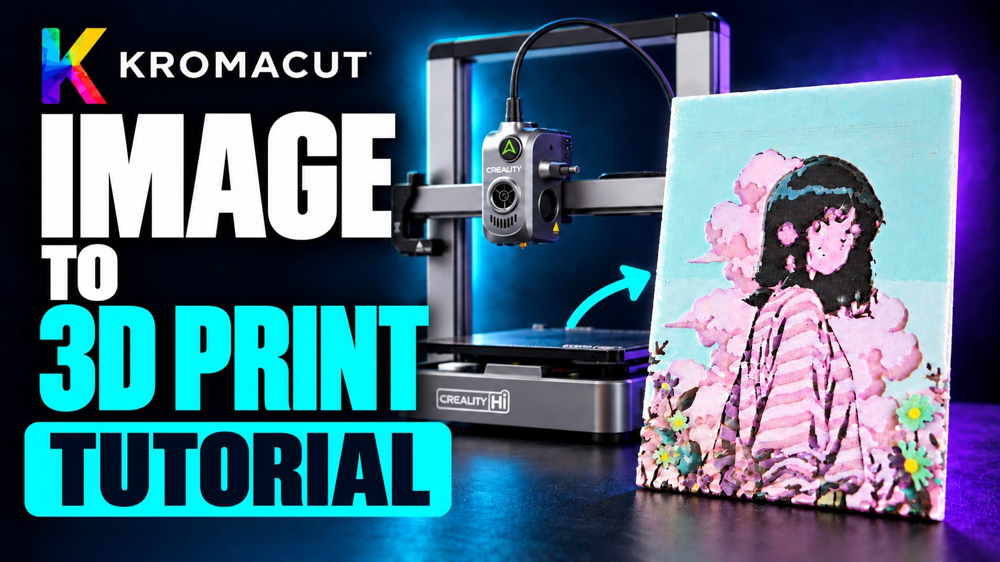
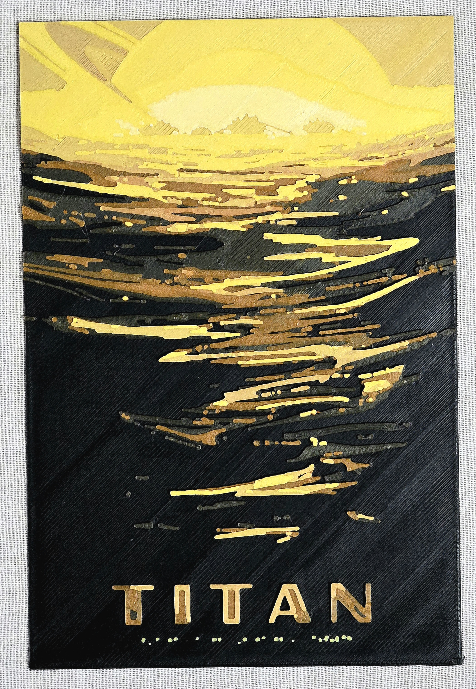
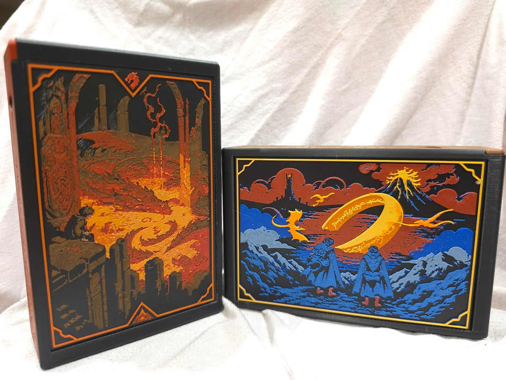
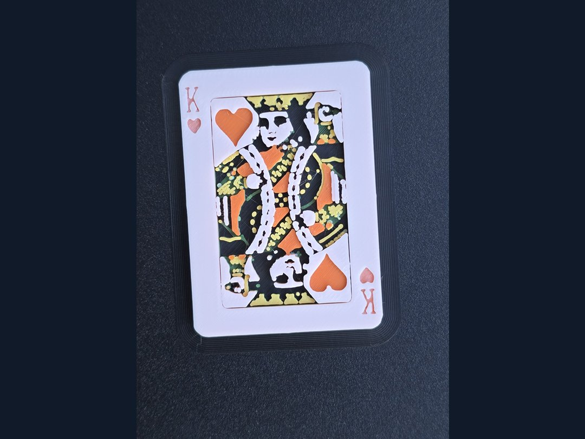
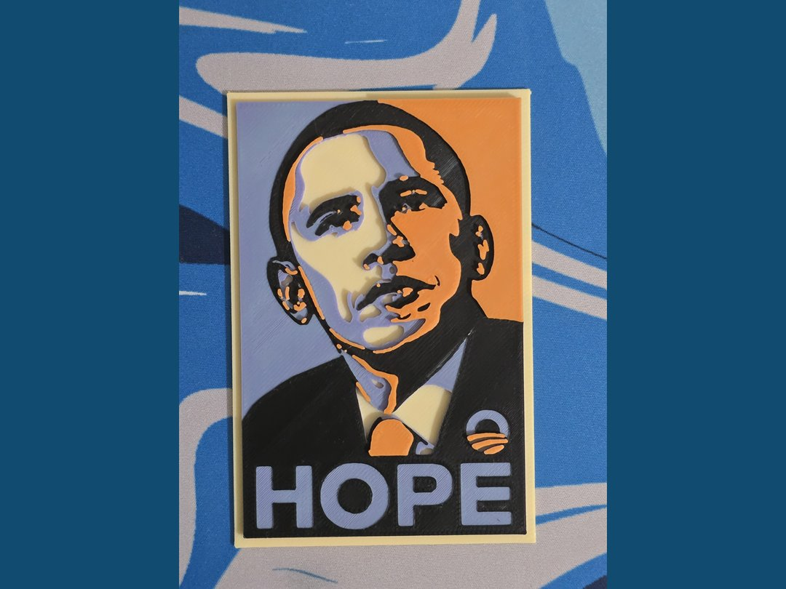
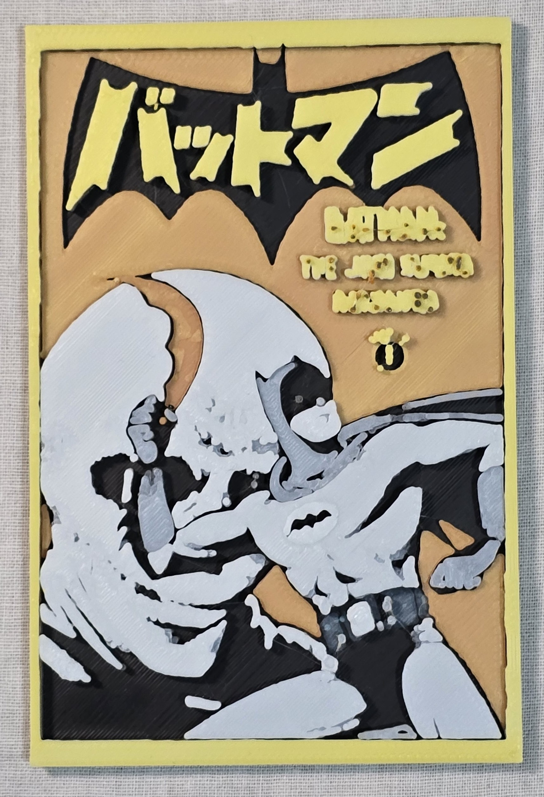
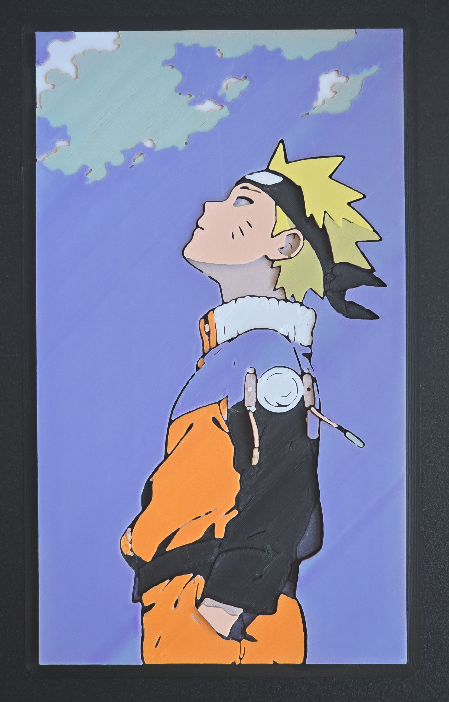

# Kromacut

Turn a 2D image into a stacked, color-layered 3D print. Kromacut is a free, open-source HueForge-style tool that runs in your browser or as a desktop app for Windows, macOS, and Linux.

[](https://github.com/vycdev/Kromacut/releases/latest) [](https://github.com/vycdev/Kromacut/releases) [](https://github.com/vycdev/Kromacut/releases/latest) [](https://github.com/vycdev/Kromacut)

[](https://www.patreon.com/cw/vycdev) [](https://discord.gg/nU63sFMcnX) [](https://www.reddit.com/r/kromacut/) [](https://www.youtube.com/@vycdev)

**[Open the app](https://kromacut.com/app)** | [Website](https://kromacut.com/) | [User documentation](https://kromacut.com/docs/overview) | [Desktop downloads](https://github.com/vycdev/Kromacut/releases)

[Video guides](#video-guides) | [Examples](#examples) | [Features](#features) | [Documentation](#documentation) | [Desktop app](#native-desktop-app-tauri) | [Development](#development) | [Contributing](#contributing)

## Video guides

Click a thumbnail to watch on YouTube.

### Tutorial

[Turn Any Image into a Multicolor 3D Print | Kromacut Tutorial](https://youtu.be/NnaTVuJ2Sps) - Follow the image-to-print workflow.

[](https://youtu.be/NnaTVuJ2Sps)

### Original introduction

[I Recreated the Industry's Most Advanced 3D Printing App... For Free](https://youtu.be/nTcZJ2gG7zo) - Meet the project and the idea behind Kromacut.

[](https://youtu.be/nTcZJ2gG7zo)

For current controls and settings, use the [written quick start](https://kromacut.com/docs/quick-start) alongside the videos.

## Examples

<table>
  <tr>
    <td align="center" valign="top" width="33%">
      <strong>Titan</strong><br>
      <a href="content/community/titan-finished.jpg"></a><br>
      <sub>vycdev | <a href="https://www.jpl.nasa.gov/images/titan-jpl-travel-poster/">NASA/JPL artwork</a></sub>
    </td>
    <td align="center" valign="top" width="33%">
      <strong>Hobbits and Dragons</strong><br>
      <a href="content/community/hobbits-and-dragons-1.jpg"></a><br>
      <sub><a href="https://www.reddit.com/r/kromacut/comments/1vum7om/hobbits_and_dragons/">u/ominaex25</a></sub>
    </td>
    <td align="center" valign="top" width="33%">
      <strong>King of Hearts</strong><br>
      <a href="content/community/king-of-hearts.jpg"></a><br>
      <sub>vycdev</sub>
    </td>
  </tr>
  <tr>
    <td align="center" valign="top" width="33%">
      <strong>Hope poster</strong><br>
      <a href="content/community/hope-finished.jpg"></a><br>
      <sub>vycdev</sub>
    </td>
    <td align="center" valign="top" width="33%">
      <strong>Batmanga</strong><br>
      <a href="content/community/batmanga-finished.jpg"></a><br>
      <sub>vycdev | <a href="https://m.media-amazon.com/images/I/81rOZq5ZgqL._AC_UF1000,1000_QL80_.jpg">Jiro Kuwata / DC artwork</a></sub>
    </td>
    <td align="center" valign="top" width="33%">
      <strong>Naruto</strong><br>
      <a href="content/community/naruto-finished.jpg"></a><br>
      <sub>vycdev | <a href="https://in.pinterest.com/pin/169870217190172931/">Artwork source</a></sub>
    </td>
  </tr>
</table>

## Features

### Image preparation

Non-destructive image adjustments, cropping, resizing, color reduction, and dedithering turn artwork into a compact palette. Brush, Eraser, Fill, Text, and color-picking tools support pixel touch-ups, while custom and supplier palettes provide reusable color sets.

### Auto-paint

Auto-paint plans physical layer stacks from the filaments you own, using their colors and Hiding Distance (HD) to predict thin-layer blends. Five deterministic search effort options, repeated filament swaps, region weighting, color separation, and height dithering offer control over the result.

### Manual mode

Direct control over palette colors, stack order, and per-color heights supports simple layered designs and carefully tuned color transitions.

### Filament calibration and profiles

Printed wedges measure frontlit hiding distance. Palette Proofs compare candidate stacks for artwork colors, while photographed Stack Matrices record measured recipe colors. Reusable `.kfil` profiles keep filament settings and calibration evidence together, with profile sharing and HueForge spool-library import.

### 3D preview

Layer-by-layer inspection reveals the stack from foundation to top. Simulated and Physical color modes compare predicted blends with real filament assignments; **Color accurate**, **Shaded**, **Transparent**, and **Wireframe** views offer different ways to inspect the model.

### STL and 3MF export

Binary STL and color-aware 3MF exports connect the model to compatible slicers. Auto-paint 3MFs preserve physical filament colors rather than assigning a material to every predicted shade. Standard layered prints include plain-text instructions with starting colors and filament swap layers.

### Flat Paint (experimental)

Face-up and face-down layouts turn layered artwork into a uniform-thickness slab for bookmarks, coasters, and other flat pieces. Flat Paint supports suitable multi-material workflows and exports as 3MF.

The [documentation](#documentation) covers settings, calibration, and printing workflows in detail.

## Documentation

The [user documentation](https://kromacut.com/docs/overview) is also available inside the app. Start with the guide for your task:

| Task | Guide |
| --- | --- |
| Make your first print | [Quick start](https://kromacut.com/docs/quick-start) |
| Prepare and clean up artwork | [Loading images](https://kromacut.com/docs/loading-images), [Image adjustments](https://kromacut.com/docs/image-adjustments), [Reducing colors](https://kromacut.com/docs/reducing-colors), [Dedithering](https://kromacut.com/docs/dedithering-cleanup) |
| Set dimensions and plan layers | [3D mode](https://kromacut.com/docs/3d-mode), [Auto-paint](https://kromacut.com/docs/auto-paint), [Flat Paint](https://kromacut.com/docs/flat-paint) |
| Calibrate filaments and check blends | [Calibration workflows](https://kromacut.com/docs/calibration-workflows), [Calibration theory](https://kromacut.com/docs/calibration-theory) |
| Export and set up the slicer | [Generating and exporting output](https://kromacut.com/docs/generating-exporting-output) |
| Find settings or solve a problem | [Settings and controls](https://kromacut.com/docs/settings-and-controls), [Troubleshooting](https://kromacut.com/docs/troubleshooting), [FAQ](https://kromacut.com/docs/faq) |

For project changes, see the [Changelog](CHANGELOG.md).

## Native desktop app (Tauri)

Download a pre-built app from [GitHub Releases](https://github.com/vycdev/Kromacut/releases):

| Platform | Download |
| --- | --- |
| macOS Apple Silicon | `*_aarch64.dmg` |
| macOS Intel | `*_x86_64.dmg` |
| Windows | `*-setup.exe` |
| Windows without internet access | `*_offline-setup.exe` (includes the WebView2 offline installer) |
| Linux | `*.AppImage` or `*.deb` |

The desktop app can check for new versions and open the release download page. See [Update checker documentation](docs/UPDATE_CHECKER.md) for details.

For installation help and platform requirements, see [Troubleshooting](https://kromacut.com/docs/troubleshooting) and the [desktop distribution notes](docs/TAURI.md#distribution-notes).

## Development

The app uses React, TypeScript, and Vite, with Three.js for the 3D preview and Tauri for desktop builds. Auto-paint runs in a worker, and mesh/export loops yield during large jobs to keep the UI responsive.

### Web app

Use **Node.js 22.18+** and npm. The build and test scripts use [Node's built-in TypeScript support](https://nodejs.org/docs/latest-v22.x/api/typescript.html). Run these commands from the repository root:

```bash
npm ci
npm run dev
```

Useful checks and production commands:

```bash
npm run lint
npm run test:docs
npm test
npm run build
npm run preview
```

### Desktop app

Install Rust and the [Tauri platform prerequisites](https://tauri.app/start/prerequisites/), then install npm dependencies as above:

```bash
npm run tauri:dev
npm run tauri:build
```

Build artifacts are created under `src-tauri/target/release/bundle/`. See [TAURI.md](docs/TAURI.md) for development and distribution, and its [versioning and release guide](docs/TAURI.md#versioning-and-release) for publishing releases.

## Contributing

Contributions are welcome. Open an [issue](https://github.com/vycdev/Kromacut/issues) or pull request for bugs, improvements, or feature suggestions. For larger architecture or algorithm changes, open an issue describing the approach first.

Read [AGENTS.md](AGENTS.md) for repository guidance. Changes to geometry or exports should include focused regression coverage; user-facing workflow changes should also update the guides in `src/docs`.

## Community and support

Share prints and get help on Discord or Reddit, follow development on YouTube, or support the project on Patreon.

## Star History

[](https://www.star-history.com/#vycdev/kromacut&type=date&legend=top-left)

## License

Kromacut is free software licensed under the GNU Affero General Public License v3.0 only (`AGPL-3.0-only`). See [LICENSE](LICENSE).

Copyright (C) 2025 vycdev. Redistribution and modified versions must preserve the copyright and license notices. Modified desktop distributions must provide the corresponding source under the AGPL, and modified hosted/network versions must also offer source access to their users.
